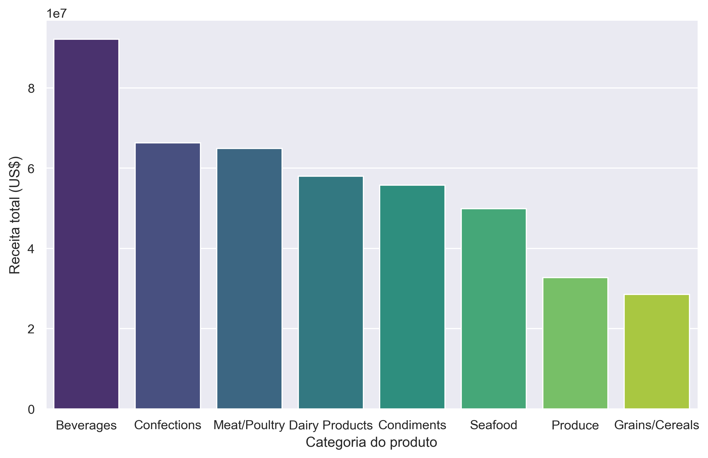
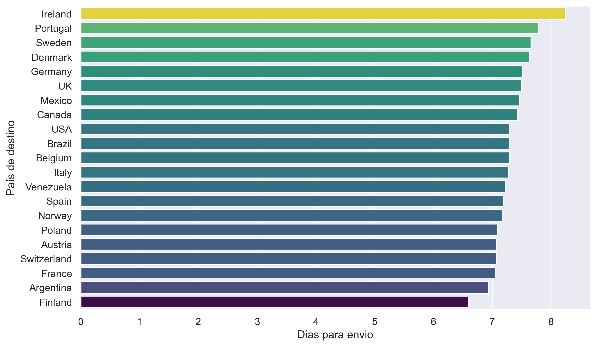
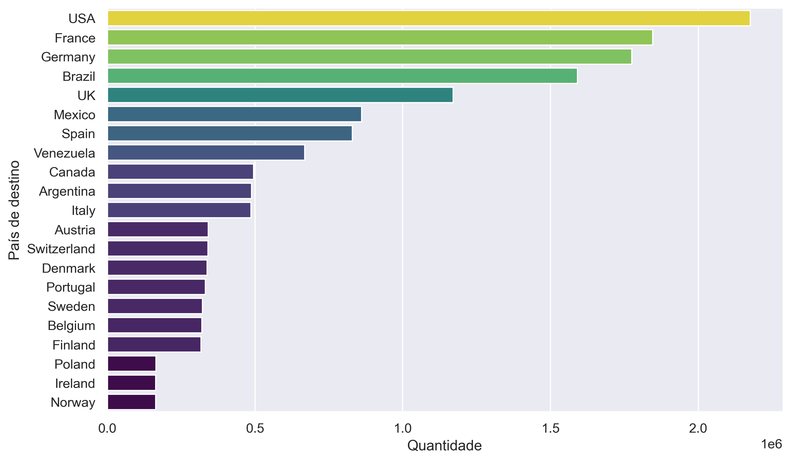
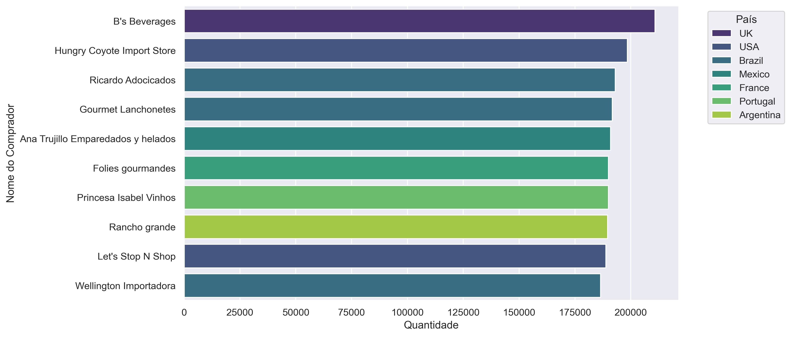

# Análise de Performance de Vendas e Logística - Northwind Trading

Este projeto consiste em uma análise exploratória completa de um banco de dados relacional (SQLite), integrando dados de vendas, produtos, clientes e logística. O objetivo foi transformar dados brutos em insights estratégicos para a tomada de decisão.

## 🛠️ Tecnologias e Ferramentas
* **Linguagem:** Python 3.x
* **Banco de Dados:** SQLite
* **Bibliotecas de Manipulação:** Pandas e NumPy
* **Visualização de Dados:** Seaborn e Matplotlib
* **Ambiente:** Jupyter Notebook / Anaconda

## 📊 Estrutura do Projeto (ETL & Engenharia de Dados)
A etapa de engenharia foi o coração do projeto, onde realizei:
1. **Extração (SQL):** Construção de uma query complexa utilizando 6 tabelas (`Orders`, `Customers`, `Order Details`, `Products`, `Categories`, `Employees`) via `JOINs`.
2. **Transformação:** * Cálculo de **Receita Líquida** considerando o campo `Discount`.
    * Tratamento de formatos de data e cálculo de **Lead Time** (tempo de envio).
    * Agregações multi-nível com `.agg()` para identificar KPIs por cliente e país.

## 📈 Principais Insights (Business Intelligence)

### 1. Perfil de Faturamento
Identificamos que as categorias **Beverages (Bebidas)** e **Confections (Doces)** lideram o faturamento. Por outro lado, a categoria de Grãos/Cereais apresenta a menor performance.

### 2. Eficiência Logística
O tempo médio de envio (Lead Time) global varia entre 6 e 8 dias.
* **Benchmarking:** Argentina e Finlândia possuem as operações de envio mais rápidas.
* **Pontos Críticos:** Mercados de alto volume como **EUA e Brasil** apresentam os maiores tempos de entrega, sugerindo a necessidade de otimização logística nessas regiões.

### 3. Volume por País e Carteira de Clientes
Os mercados de maior volume são EUA, França e Alemanha. No detalhamento dos clientes, a **BS Beverages (UK)** lidera em volume, mas o Brasil se destaca no Top 5 com empresas como a **Ricardo Adocicados**.

---

## 🚀 Como executar o projeto
1. Certifique-se de ter o Python e o Jupyter instalado (recomendo o Anaconda).
2. Clone este repositório.
3. Certifique-se de que o arquivo `northwind.db` está na mesma pasta do notebook.
4. Execute o arquivo `analise_vendas_logistica_northwind.ipynb`.